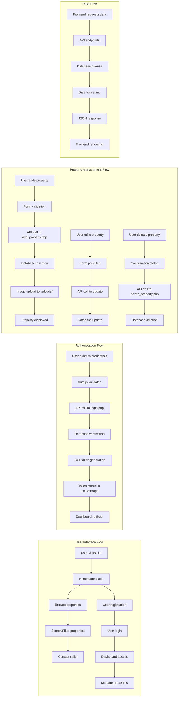
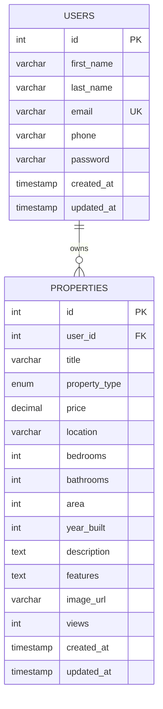

# PropFind Real Estate Platform - Architecture Diagram

## System Architecture Overview

```mermaid
graph TB
    %% User Layer
    subgraph "Client Layer"
        A[Web Browser]
        B[HTML Pages]
        C[JavaScript Modules]
        D[CSS Styling]
    end

    %% Frontend Components
    subgraph "Frontend Components"
        E[index.html - Homepage]
        F[login.html - Authentication]
        G[register.html - User Registration]
        H[dashboard.html - User Dashboard]
        I[style.css - Styling]
    end

    %% JavaScript Layer
    subgraph "JavaScript Layer"
        J[script.js - Main App Logic]
        K[auth.js - Authentication Manager]
        L[dashboard.js - Dashboard Manager]
        M[counter.js - Statistics]
    end

    %% API Layer
    subgraph "Backend API Layer"
        N[config.php - Database Config]
        O[login.php - User Login]
        P[register.php - User Registration]
        Q[get_properties.php - Property Retrieval]
        R[get_user_properties.php - User Properties]
        S[add_property.php - Add Property]
        T[delete_property.php - Delete Property]
        U[update_profile.php - Profile Update]
    end

    %% Database Layer
    subgraph "Database Layer"
        V[(MySQL Database)]
        W[users table]
        X[properties table]
        Y[Indexes & Relationships]
    end

    %% File Storage
    subgraph "File Storage"
        Z[uploads/ - Property Images]
    end

    %% Setup & Configuration
    subgraph "Setup & Configuration"
        AA[setup.php - Database Setup]
        BB[schema.sql - Database Schema]
        CC[package.json - Dependencies]
    end

    %% Connections
    A --> B
    B --> C
    C --> D
    
    E --> J
    F --> K
    G --> K
    H --> L
    
    J --> N
    K --> O
    K --> P
    L --> R
    L --> S
    L --> T
    L --> U
    
    N --> V
    O --> V
    P --> V
    Q --> V
    R --> V
    S --> V
    T --> V
    U --> V
    
    V --> W
    V --> X
    V --> Y
    
    S --> Z
    
    AA --> V
    BB --> V

    %% Styling
    classDef frontend fill:#e1f5fe
    classDef backend fill:#f3e5f5
    classDef database fill:#e8f5e8
    classDef storage fill:#fff3e0
    
    class A,B,C,D,E,F,G,H,I,J,K,L,M frontend
    class N,O,P,Q,R,S,T,U backend
    class V,W,X,Y database
    class Z,AA,BB,CC storage
```



## Detailed Component Architecture



## Technology Stack

### Frontend Technologies
- **HTML5**: Semantic markup for structure
- **CSS3**: Modern styling with Flexbox/Grid
- **Vanilla JavaScript**: ES6+ features, classes, async/await
- **Font Awesome**: Icons and UI elements
- **Responsive Design**: Mobile-first approach

### Backend Technologies
- **PHP 7.4+**: Server-side scripting
- **MySQL**: Relational database
- **PDO**: Database abstraction layer
- **JWT**: Token-based authentication
- **CORS**: Cross-origin resource sharing

### Security Features
- **Password Hashing**: PHP password_hash()
- **JWT Tokens**: Secure authentication
- **SQL Injection Protection**: Prepared statements
- **Input Validation**: Client and server-side
- **CORS Headers**: Proper cross-origin handling

## Database Schema



## API Endpoints

### Authentication Endpoints
- `POST /api/login.php` - User authentication
- `POST /api/register.php` - User registration

### Property Endpoints
- `GET /api/get_properties.php` - Retrieve all properties (with filters)
- `GET /api/get_user_properties.php` - Get user's properties (authenticated)
- `POST /api/add_property.php` - Add new property (authenticated)
- `POST /api/delete_property.php` - Delete property (authenticated)

### User Management
- `POST /api/update_profile.php` - Update user profile (authenticated)

## File Structure

```
Real-estate-main/
├── Frontend Files
│   ├── index.html              # Main homepage
│   ├── login.html              # Login page
│   ├── register.html           # Registration page
│   ├── dashboard.html          # User dashboard
│   ├── style.css              # Main stylesheet
│   ├── script.js              # Main application logic
│   ├── auth.js                # Authentication management
│   ├── dashboard.js           # Dashboard functionality
│   └── counter.js             # Statistics counter
├── Backend API
│   ├── config.php             # Database configuration
│   ├── schema.sql             # Database schema
│   ├── login.php              # Login endpoint
│   ├── register.php           # Registration endpoint
│   ├── get_properties.php     # Property retrieval
│   ├── get_user_properties.php # User properties
│   ├── add_property.php       # Add property
│   ├── delete_property.php    # Delete property
│   └── update_profile.php     # Profile update
├── Setup & Configuration
│   ├── setup.php              # Database setup script
│   ├── package.json           # Node.js dependencies
│   └── README.md              # Documentation
└── Storage
    └── uploads/               # Property images storage
```

## Key Features

### User Features
- **Property Browsing**: Search and filter properties
- **User Registration/Login**: Secure authentication
- **Property Management**: Add, edit, delete properties
- **Contact System**: Direct communication with sellers
- **Dashboard**: Personal property management interface

### Technical Features
- **Responsive Design**: Works on all devices
- **Real-time Updates**: Dynamic content loading
- **Secure Authentication**: JWT-based security
- **Database Optimization**: Indexed queries
- **Error Handling**: Comprehensive error management
- **Fallback Systems**: Local storage backup

## Security Implementation

1. **Authentication**: JWT tokens with expiration
2. **Password Security**: PHP password_hash() with salt
3. **SQL Injection Prevention**: Prepared statements
4. **Input Validation**: Both client and server-side
5. **CORS Protection**: Proper header configuration
6. **XSS Prevention**: Input sanitization

## Performance Optimizations

1. **Database Indexing**: Optimized query performance
2. **Image Optimization**: Efficient image handling
3. **Caching**: Local storage fallback
4. **Lazy Loading**: On-demand content loading
5. **Responsive Images**: Adaptive image sizing
